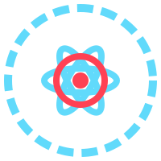

# React Capture Events

<div align="center">
  <p align="center">
    
  </p>
</div>

A React library to capture and display events in a user-friendly interface. This library provides components to log, view, and manage events in your React application.

- [🚀 Features](#-features)
- [📦 Installation](#-installation)
- [⚙️ Compatibility](#️-compatibility)
- [🛠 Usage](#-usage)
  - [Basic Setup](#basic-setup)
  - [Setting Up the Service Worker](#setting-up-the-service-worker)
  - [Where to Place the File](#where-to-place-the-file)
- [📝 Capturing Events](#-capturing-events)
- [🗑 Clearing Events](#-clearing-events)
- [📊 Possible Use Cases](#-possible-use-cases)
- [📚 Examples](#-examples)
  - [Basic Example](#basic-example)
  - [Advanced Example](#advanced-example)
- [📄 License](#-license)

## 🚀 Features

- Capture and display events in real-time
- Switch between individual event view and table view
- Clear all captured events
- Responsive and interactive UI

## 📦 Installation

Install the library using npm:

```bash
npm install react-capture-events
```

or yarn:

```bash
yarn add react-capture-events
```

## ⚙️ Compatibility

The react-capture-events library is compatible with the following versions of React:

- React 17.x
- React 18.x

## 🛠 Usage

### Basic Setup

1. **Register the Service Worker**

   Register the service worker to enable event capturing:

   ```jsx
   import { registerServiceWorker } from 'react-capture-events'

   registerServiceWorker()
   ```

2. **Wrap Your Application with the Provider**

   Wrap your application with the CaptureEventProvider to provide context for capturing events:

   ```jsx
   import React from 'react'
   import ReactDOM from 'react-dom'
   import { CaptureEventProvider } from 'react-capture-events'
   import App from './App'

   ReactDOM.render(
     <CaptureEventProvider>
       <App />
     </CaptureEventProvider>,
     document.getElementById('root'),
   )
   ```

3. **Use the CapturedEventsList Component**

   Add the CapturedEventsList component to your application to display the captured events:

   ```jsx
   import React from 'react'
   import { CapturedEventsList } from 'react-capture-events'

   const App = () => (
     <div>
       <h1>My Application</h1>
       <CapturedEventsList />
     </div>
   )

   export default App
   ```

### Setting Up the Service Worker

To ensure event capturing works correctly, you need to set up the service worker. Create a file named `sw.js` and add the following code:

```javascript
let events = []

self.addEventListener('install', (event) => {
  console.log('Service Worker installed')
  event.waitUntil(self.skipWaiting())
})

self.addEventListener('activate', (event) => {
  console.log('Service Worker activated')
  event.waitUntil(self.clients.claim())
})

self.addEventListener('message', (event) => {
  if (event.data.type === 'LOG_EVENT') {
    const newEvent = {
      eventName: event.data.eventName,
      eventData: event.data.eventData,
      timestamp: new Date().toISOString(),
    }
    events.push(newEvent)

    if (events.length > 100) {
      events.shift()
    }
  }

  if (event.data.type === 'GET_EVENTS') {
    event.source.postMessage({ type: 'EVENTS_LIST', events })
  }

  if (event.data.type === 'CLEAR_EVENTS') {
    events = []
    event.source.postMessage({ type: 'EVENTS_CLEARED' })
  }
})
```

#### Where to Place the File

Place the `sw.js` file at the root of your project. Make sure to register it correctly using the code shown in the Basic Setup section to ensure the service worker is active and ready to capture events.

## 📝 Capturing Events

To capture events, send messages to the service worker:

```javascript
navigator.serviceWorker.controller.postMessage({
  type: 'LOG_EVENT',
  eventName: 'MyEvent',
  eventData: { key: 'value' },
})
```

## 🗑 Clearing Events

To clear all captured events, send a `CLEAR_EVENTS` message to the service worker:

```javascript
navigator.serviceWorker.controller.postMessage({
  type: 'CLEAR_EVENTS',
})
```

## 📊 Possible Use Cases

The React Capture Events library can be applied in various scenarios where capturing, visualizing, and managing events is required. The implementation of these use cases should be done in conjunction with appropriate tools and workflows to handle specific requirements, such as logging, analysis, or integration with other systems. Below are some potential use cases:

1. **Application Debugging and Monitoring**
   Capture user interactions and system events in real-time to simplify debugging and application monitoring during development.

2. **User Behavior Analysis**
   Collect user interaction data, such as clicks and page navigation, to gain insights into user behavior and enhance the user experience.

3. **Automated Testing**
   Capture events during automated tests to verify if all expected interactions are triggered correctly during integration or end-to-end testing.

4. **Event Auditing and Logging**
   Implement event logging for compliance and security, maintaining a detailed history of user actions, such as configuration changes or access to sensitive data.

5. **Feedback and Customer Support**
   Provide detailed event logs to support teams, helping to resolve user issues more efficiently by capturing relevant events, including errors.

6. **Performance Analysis**
   Capture performance-related events like page and component load times to identify bottlenecks and areas for improvement.

7. **Educational Applications**
   Track user progress and interactions on educational platforms to provide personalized learning experiences and feedback to learners.

## 📚 Examples

### Basic Example

```jsx
import React from 'react'
import { CaptureEventProvider, CapturedEventsList } from 'react-capture-events'

function App() {
  return (
    <CaptureEventProvider>
      <div>
        <h1>Event Capture Example</h1>
        <CapturedEventsList />
      </div>
    </CaptureEventProvider>
  )
}

export default App
```

### Advanced Example

```jsx
import React, { useEffect } from 'react'
import {
  CaptureEventProvider,
  CapturedEventsList,
  captureEvent,
} from 'react-capture-events'

function App() {
  useEffect(() => {
    // Simulate capturing an event
    captureEvent({ type: 'click', message: 'Button clicked' })
  }, [])

  return (
    <CaptureEventProvider>
      <div>
        <h1>Advanced Event Capture Example</h1>
        <button
          onClick={() =>
            captureEvent({ type: 'click', message: 'Button clicked' })
          }
        >
          Click Me
        </button>
        <CapturedEventsList />
      </div>
    </CaptureEventProvider>
  )
}

export default App
```

## 📄 License

This project is licensed under the MIT License. See the [LICENSE](LICENSE) file for details.
